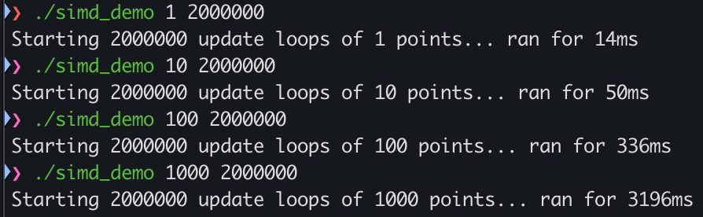
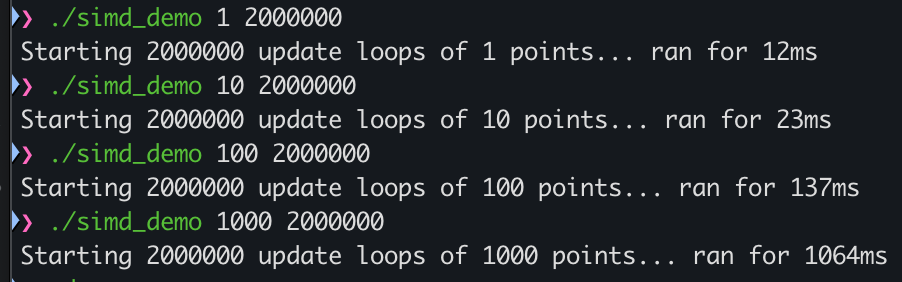
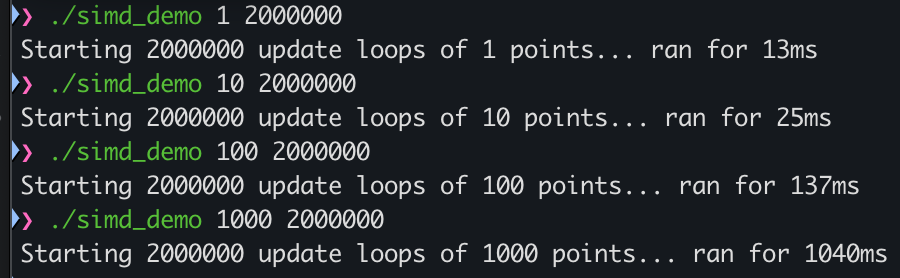
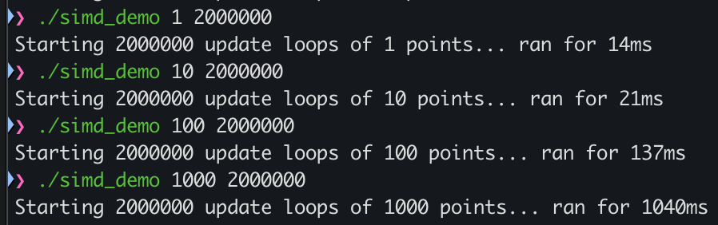

## Première étape - Prise en main
Impossible, je suis sur mac, faudrait que je fasse sur les ordis de la salle de classe mais chiant.

## Seconde étape - Optimisation par le compilateur

**-O0**

**-O2**

**-O3**

**-O3 -march=native**

